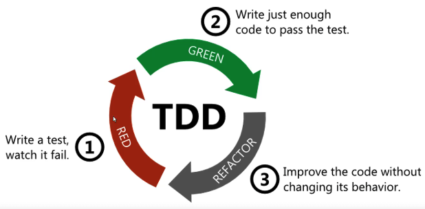

## Ciclo de vida dos Testes no Junit 5

# Metodologia TDD (Test Driving Development)

## Introdução

Uma das metodologias mais populares para testes de código é o **TDD**. Ele permite testar o código de maneira **granular**, tornando-se cada vez mais comum entre desenvolvedores. O conceito principal é que você codifica o teste **antes mesmo do código existir**.

Para iniciantes, essa ideia pode parecer intrigante, mas, no final das contas, é uma abordagem simples e poderosa. Vamos explorá-la em detalhes.

---

## O que é TDD?

TDD é a sigla para **Test Driving Development**, que, traduzido, significa **Desenvolvimento Orientado a Testes**. A principal ideia do TDD é trabalhar em **ciclos curtos e contínuos**. Esses ciclos seguem a seguinte ordem:

1. **Red**: Escreva um teste unitário que inicialmente irá falhar, pois o código ainda não foi implementado.
2. **Green**: Implemente o código necessário para passar no teste, transformando a falha em sucesso.
3. **Refactoring**: Refatore o código para melhorar sua legibilidade, estrutura e qualidade, mantendo os testes passando.

---

## O Ciclo do TDD

O TDD pode ser resumido no ciclo **Red, Green, Refactoring, Repeat**:

1. **Red**:
    - Escreva um pequeno teste automatizado.
    - O teste deve falhar ao ser executado, já que o código ainda não existe.

2. **Green**:
    - Implemente o código mínimo necessário para que o teste passe.
    - O objetivo é sair do estado de falha (vermelho) para o sucesso (verde).

3. **Refactoring**:
    - Melhore o código que foi implementado, ajustando pontos como legibilidade, funcionalidade e estrutura.
    - Certifique-se de que o teste continua passando após a refatoração.

4. **Repeat**:
    - Repita o ciclo para cada nova funcionalidade ou comportamento que precise ser testado.

---

## Resumo Visual do Ciclo

- **Red**: Escreva um teste -> Ele falha.
- **Green**: Escreva o código -> O teste passa.
- **Refactoring**: Melhore o código -> Garanta que o teste continua passando.
- **Repeat**: Reinicie o ciclo para a próxima funcionalidade.

---

## Considerações Finais

É importante destacar que o **TDD não é apenas uma forma de escrever testes**, mas sim uma **metodologia de desenvolvimento**. O objetivo é avaliar o comportamento de classes e métodos específicos, garantindo que cada funcionalidade seja cuidadosamente planejada, implementada e testada.

Com o TDD, você adota uma abordagem iterativa e confiável, contribuindo para um código mais robusto e de qualidade.

